| Nama       | Fikri abei |
|------------|------------|
| Kelas      | TI.20.A.1  |
| Nim        | 312010417  |
| Matkul     | Pemoggraman Web |

## Langkah-langkah Praktikum
Persiapan membuat dokumen HTML dengan nama file lab4_box.html seperti berikut.
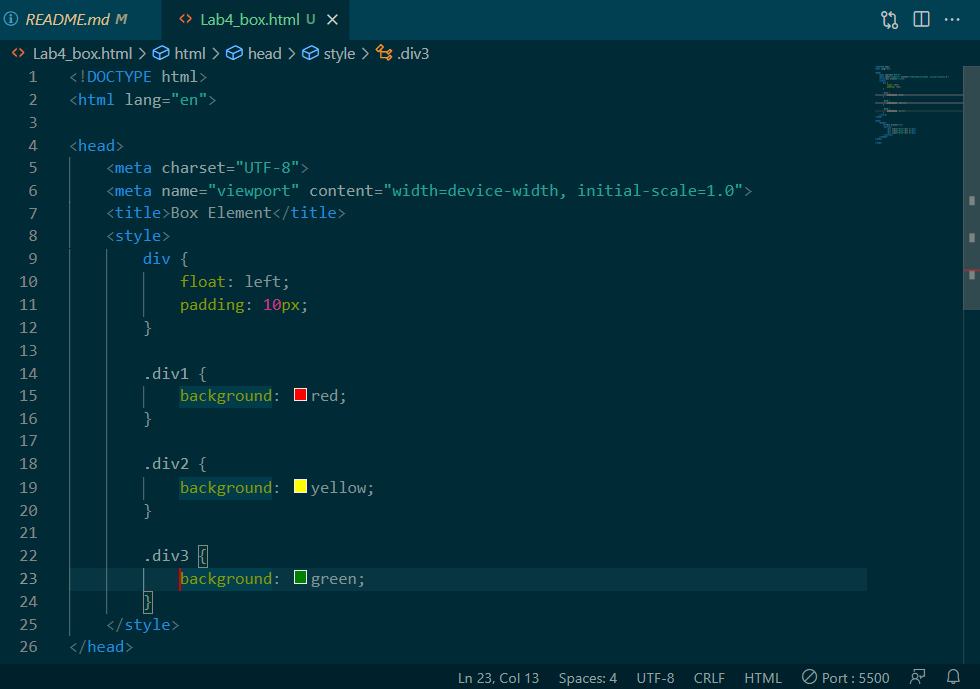

## Membuat Box Element
Kemudian tambahkan kode untuk membuat box element dengan tag div seperti berikut.
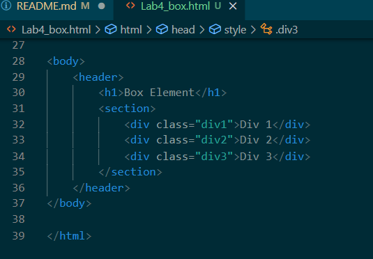

## CSS Float Property
Selanjutnya tambahkan deklarasi CSS pada head untuk membuat float element, seperti berikut.
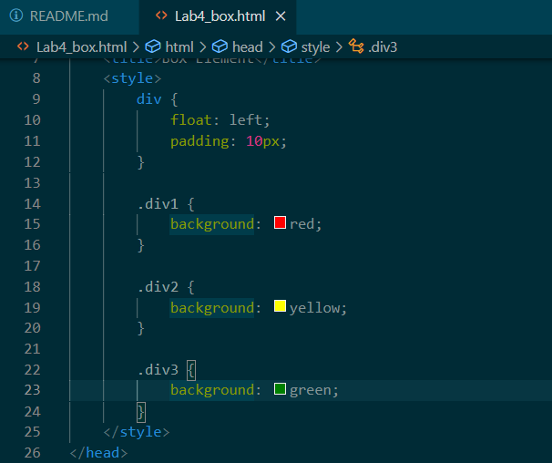
Kemudian buka browser untuk melihat hasinya

## Mengatur Clearfix Element
Clearfix digunakan untuk mengatur element setelah float element. Property clear digunakan untuk
mengaturnya.
Tambahkan element div lainnya seteleah div3 seperti berikut.
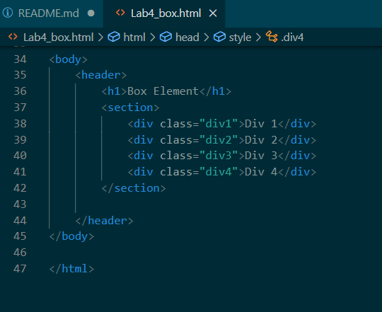
Kemudian atur property clear pada CSS, seperti berikut.
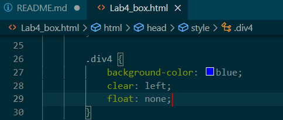
Selanjutnya buka browser dan refresh kembali.

Lakukan eksperimen terhadap penggunaan property clear dengan nilai lainnya (left, both, right),
dan amati perubahannya.
## Membuat Layout Sederhana
Buat folder baru dengan nama lab4_layout, kemudian buatlah file baru didalamnya dengan nama
home.html, dan file css dengan nama style.css.
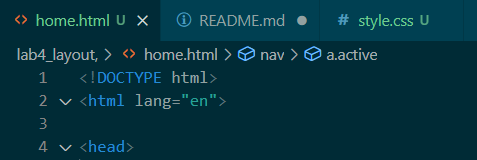
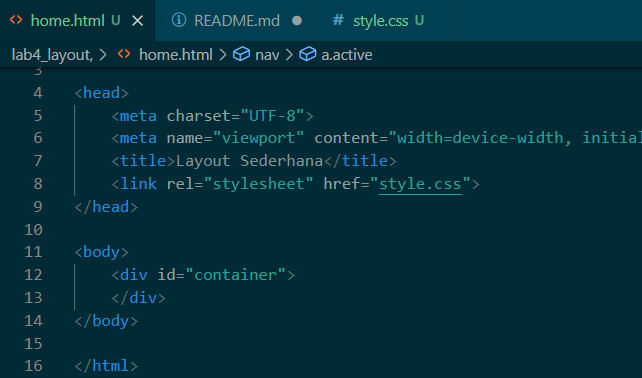
Kemudian tulis kode berikut.
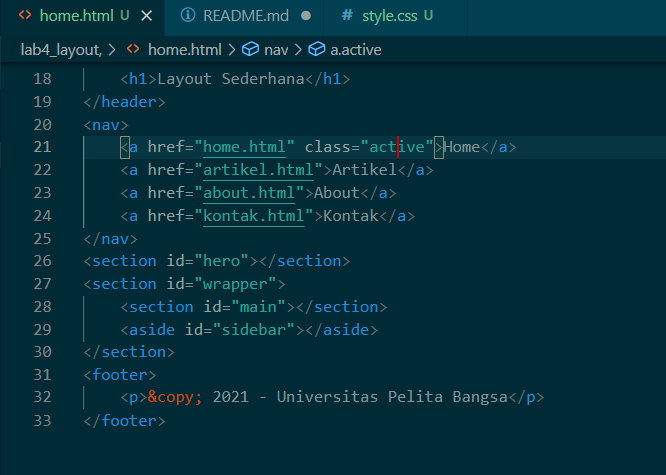
Kemudian buka browser dan lihat hasilnya.

Kemudian tambahkan kode CSS untuk membuat layoutnya.

Kemudian lihat hasilnya pada browser.

## Membuat Navigasi
Kemudian selanjutnya mengatur navigasi.
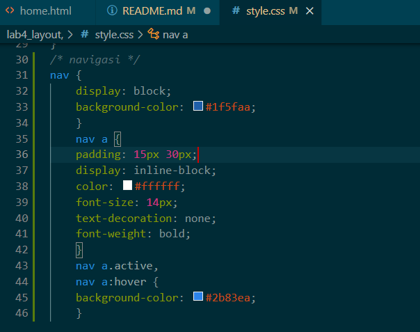
Kemudian lihat hasilnya.
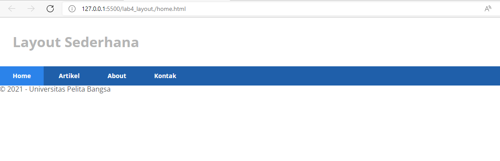

## Membuat Hero Panel.
Selanjutnya membuat hero panel. Tambahkan kode HTML dan CSS seperti berikut.
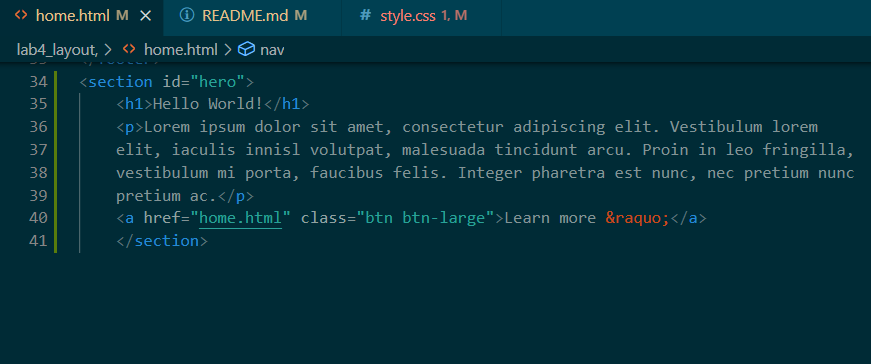
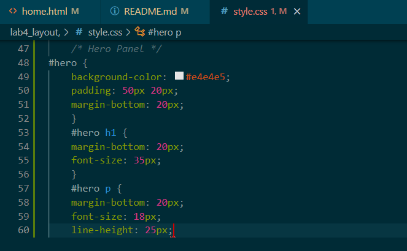
